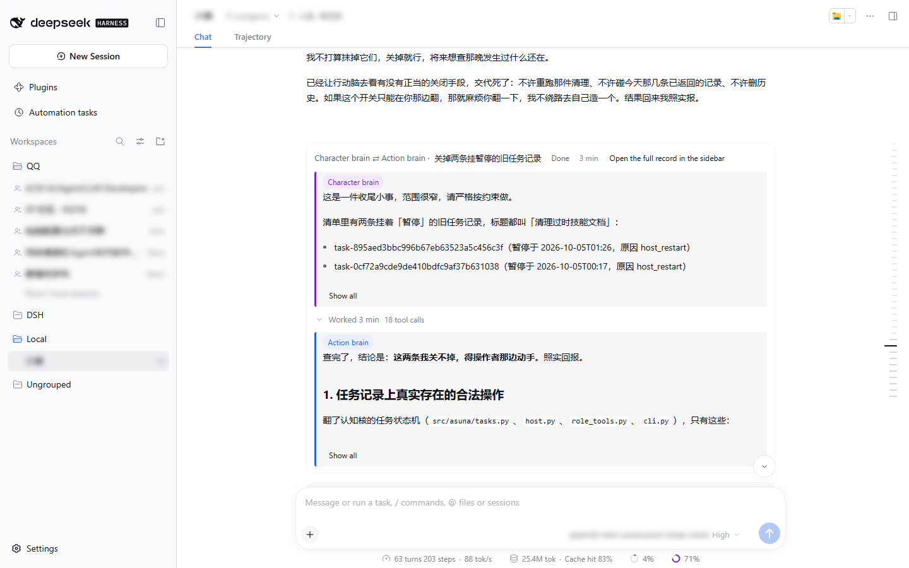
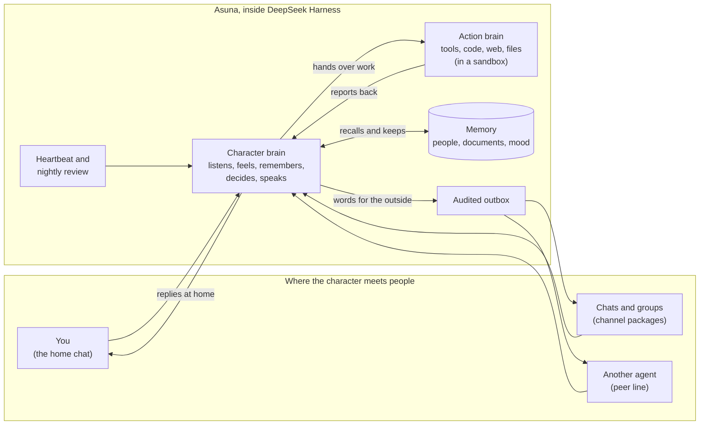

  

<h1>Asuna Cognition Core</h1>

<strong>A framework for AI characters that live with you, on your own machine.</strong>

    <a href="README_CN.md">简体中文</a>
    ·
    <a href="RUN_ASUNA.md">Running Asuna</a>
    ·
    <a href="INSTALL.md">Install</a>
  

    
    
    
    
    
  

## What Asuna is

Most chatbots wait to be spoken to, answer, and forget. Asuna is built for a character who *stays*: one with a
home, a sense of time, people they know, memories they keep, and work they can actually get done.

Asuna is the home; the character is a **persona package** you bring. The framework knows nothing about who lives in
it. Personality, voice, and skills all come from the persona package, and a different package gives you a different
character in the same home. Asuna also knows nothing about where the character meets people: each platform is a
**channel package** you plug in.

## What a character can do

**Think with two brains.** Every turn is led by the *character brain*: the part that is the character, that
listens, feels, remembers, decides what to say, and says it. When something needs doing, such as looking things up,
reading files, writing code, or checking a device, the character hands it to the *action brain*. It does the work
with real tools in a sandbox and reports back, and the character decides what the result means. You can watch both
brains side by side, each with its own colour: purple for the character, blue for the action.

**Live at home, on their own rhythm.** The private chat with the owner is the character's home, not just an inbox.
A heartbeat gives them time of their own: they can do nothing, follow up on something, or decide to drop by a group
and start a topic. Each night they look back over the day and decide what is worth remembering for good.

**Meet people where they are.** In group chats the character reads the room before speaking. They join in when
called or when they have something to add, stay quiet when they don't, and get to know each person over time.

**Keep memories of their own.** Characters write and revise their own notes and documents, keep a mood that carries
from one conversation to the next, and recall what matters when it matters. Their inner state reaches them as words,
not numbers, and they change it by choosing, not by typing values.

**Grow by themselves.** A character keeps a notebook of things they'd like to improve, works on their own package
in its own copy, and publishes the change only once it passes its checks and has been reviewed.

**Stay trustworthy.** What a character shares with the owner stays private; groups only hear what is meant for
them. Code runs in a sandbox, everything said on a platform goes through an audited outbox, and new abilities, a
device on the home network for example, are granted one at a time when the character asks for them and says why.

**Talk to other agents.** A *peer line* connects a character to an agent living in another DeepSeek Harness, such
as an earlier version of the same character. The two can talk directly and hand knowledge over, and the line is the
character's to open or close.

## What it looks like

  

The character brain (purple) hands a small task to the action brain (blue) with clear limits;
the action brain reports what it found. The sidebar and names are blurred.

## How a moment flows

Whatever wakes the character (you, a message in a group, another agent, or their own heartbeat), the character
brain decides first. Work goes to the action brain and comes back as a report. Words for the outside world leave
only through the outbox, where each one is recorded.

## Built on DeepSeek Harness

Asuna is a set of plugins for [DeepSeek Harness](https://github.com/deepseek-ai/deepseek-harness) (DSH). DSH
supplies the agent runtime and the web interface, and Asuna adds the character on top: the two brains, memory in
MongoDB, the daily rhythm, and the channels. It reuses DSH's own interface instead of building another, so what you
see is the regular DSH web page, with the character's conversations, the two brains' colours, and a memory panel
added to it.

The repository is split the same way:

| Part | What it is |
|---|---|
| `packages/cognition-core` | The home itself: cognition, memory, the two brains, privacy and safety. It names no character and no platform. |
| `packages/channels/napcat-qq` | A channel for QQ, through NapCat. |
| `packages/channels/dsh-peer` | A channel to an agent in another DeepSeek Harness (the peer line). |
| `packages/personas/` | Persona packages, each run with a different set of channels: `ichinose-asuna` (local chat only), `kyoyama-kazusa` (QQ), and `xiaoman`, the author's personal one (QQ and a peer line). |
| `tests/fixtures/personas/demo` | A small synthetic persona, used by the tests and for trying things out. |
| `deploy/docker` | A Docker stack that runs the same install on a Linux host. |

## Getting started

You need DeepSeek Harness 0.2.0-rc.2, Python 3.12+, MongoDB, a model server for each brain (both brains may share
one), and a persona package. Optional: NapCat for QQ. Commands run under DSH's own sandbox, on Windows, Linux or
macOS.

- **Installing the released plugins into DSH:** follow [INSTALL.md](INSTALL.md). It is written so a person or a
  coding agent can follow it.
- **Running from this repository:** see [RUN_ASUNA.md](RUN_ASUNA.md). `start-asuna.cmd` (Windows) or
  `./start-asuna.sh` (Linux, macOS) opens the home; then visit the address it prints. For Docker, see
  [deploy/docker](deploy/docker/README.md).
- **For developers and coding agents:** start with [docs/DEVELOPMENT.md](docs/DEVELOPMENT.md).
  [NATIVE_PLUGIN.md](NATIVE_PLUGIN.md) explains how the packages compose inside DSH and
  [RUNTIME_API.md](RUNTIME_API.md) describes the channel and tool contracts. Design decisions are kept in
  [docs/development_plans](docs/development_plans/README.md).

## License

The core and the channel packages are licensed under the [GNU General Public License v3.0 only](LICENSE). Persona
packages are not part of the release.
