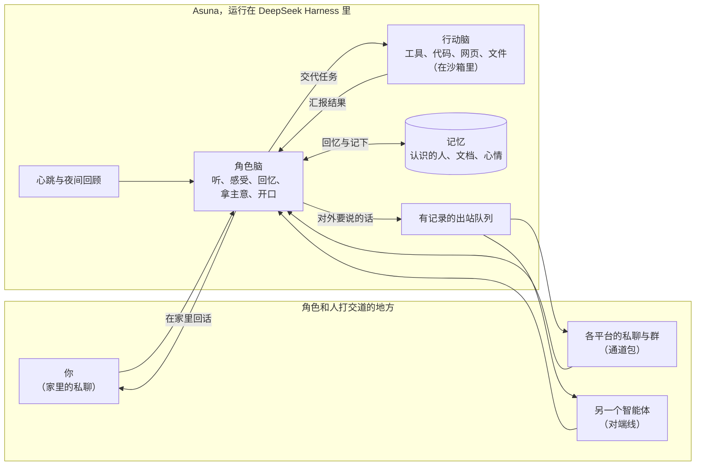

  

<h1>Asuna Cognition Core</h1>

<strong>一个让 AI 角色在你自己的电脑上「住下来」的框架。</strong>

    <a href="README.md">English</a>
    ·
    <a href="RUN_ASUNA.md">运行说明</a>
    ·
    <a href="INSTALL.md">安装</a>
  

    
    
    
    
    
  

## 这是什么

大多数聊天机器人是「你问一句、它答一句、聊完就忘」。Asuna 想做的是另一回事：让一个角色**住下来**——有一个家，有自己的作息，认识一些人，记得一些事，也真的能把事情办成。

Asuna 是这个家，住进来的角色由你带来的**人格包**决定。框架本身不认识任何角色：性格、说话的方式、会做的事，都写在人格包里；换一个人格包，同一个家里就住进了另一个角色。角色在哪里和人打交道，框架同样不预设，每个平台都是一个可以插拔的**通道包**。

## 角色能做什么

**两个脑子，一起想事。** 每一轮都由「角色脑」做主：那就是角色本身，负责听、感受、回忆、拿主意、开口说话。遇到要动手的事——查资料、读文件、写代码、看看家里的设备——就交给「行动脑」。行动脑在沙箱里用真实的工具把活干完，再把结果汇报回来，由角色脑判断这意味着什么。界面上两个脑子并排可见，各有颜色：紫色是角色脑，蓝色是行动脑。

**在家过日子，有自己的节奏。** 和主人的私聊是角色的家，不只是一个收件箱。「心跳」给了角色属于自己的时间：可以什么都不做，可以把没做完的事往前推一推，也可以决定去哪个群看看、开个话头。每天夜里，角色会回顾这一天，决定哪些值得长久记住。

**在人群里也有分寸。** 在群聊里，角色先看清场合再开口：被叫到、或者真有话想说时才接话，没话说就安静待着；对群里的每个人，会慢慢熟悉起来。

**记忆是角色自己的。** 笔记和文档由角色自己写、自己改；心情会从这段对话延续到下一段；需要的时候，能想起该想起的事。程序算出来的状态是用文字告诉角色的，不是一串数字；角色改变自己的状态，靠的是做选择，而不是填数值。

**自己成长。** 角色有一本「想改进的地方」的小本子，在自己的副本里修改自己的人格包，改动通过检查、经过审阅之后才会生效。

**值得信任。** 和主人说的私事只留在私下，群里只听得到该在群里说的话。代码跑在沙箱里，在平台上说出去的每一句话都经过有记录的出站队列；新的能力——比如连上家里的某台设备——要角色自己说清楚用来做什么，一样一样地开。

**和别的智能体对话。** 一条「对端线」可以把角色和住在另一个 DeepSeek Harness 里的智能体连起来，比如同一个角色更早的版本。两边可以直接说话、交接彼此知道的事；这条线开不开、什么时候关，由角色自己决定。

## 界面长什么样

  

角色脑（紫色）把一件范围明确的小事交给行动脑（蓝色），行动脑把查到的结果汇报回来。侧栏和名字已打码。

## 一次回合是怎么走的

不管是谁叫醒了角色——你、群里的一条消息、另一个智能体，还是角色自己的心跳——都是角色脑先拿主意。要干的活交给行动脑，干完以汇报的形式回来；要对外说的话，只能从出站队列出去，每一句都有记录。

## 建在 DeepSeek Harness 之上

Asuna 是 [DeepSeek Harness](https://github.com/deepseek-ai/deepseek-harness)（DSH）的一组插件。DSH 提供智能体运行时和网页界面，Asuna 在上面加上「角色」这一层：两个脑子、存在 MongoDB 里的记忆、每天的作息，还有各个通道。界面直接复用 DSH 自带的，不另起炉灶——你看到的就是普通的 DSH 网页，只是多了角色的对话、两个脑子的颜色和一个记忆面板。

仓库也是照这个思路拆开的：

| 部分 | 是什么 |
|---|---|
| `packages/cognition-core` | 家本身：认知、记忆、两个脑子、隐私与安全。不点名任何角色，也不点名任何平台。 |
| `packages/napcat-qq` | 通过 NapCat 接入 QQ 的通道。 |
| `packages/dsh-peer` | 通往另一个 DeepSeek Harness 里智能体的通道（对端线）。 |
| `tests/fixtures/personas/demo` | 一个小小的合成人格，测试和试用时用。 |
| `packages/xiaoman` | 作者的第一个人格，属于私人用途，之后会换成一个通用的示例。 |

## 开始使用

需要 DeepSeek Harness 0.2.0-rc.2、Python 3.12+、MongoDB、给两个脑子用的模型服务（两个脑子也可以共用一个模型），以及一个人格包。可选：用来做沙箱的 WSL + bubblewrap，接 QQ 用的 NapCat。

- **装进 DSH**：照 [INSTALL.md](INSTALL.md) 做，人或者编程智能体都能照着装。
- **运行和日常使用**：见 [RUN_ASUNA.md](RUN_ASUNA.md)。Windows 上运行 `start-asuna.cmd` 就能把家打开，再访问它打印出来的地址。
- **开发者**：通道和工具的约定见 [RUNTIME_API.md](RUNTIME_API.md)，设计决策都留在 [docs/development_plans](docs/development_plans/README.md)。

## 现状

Asuna 每天都作为作者第一个角色的家在运行。0.2.0 是第一个能装进标准 DeepSeek Harness 配置档的版本。这是一个公开分享的个人项目，还会一直变。

## 许可

核心和各通道包以 [GNU 通用公共许可证 v3.0（仅此版本）](LICENSE) 发布。人格包不在发布范围内。
