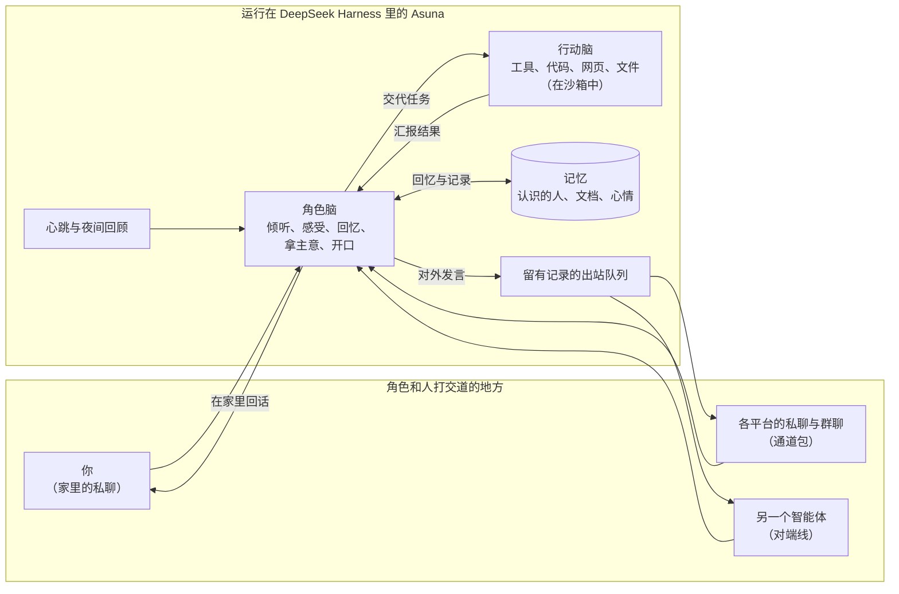

  

<h1>Asuna Cognition Core</h1>

<strong>让 AI 角色在你自己的电脑上安家落户的框架。</strong>

    <a href="README.md">English</a>
    ·
    <a href="RUN_ASUNA.md">运行说明</a>
    ·
    <a href="INSTALL.md">安装</a>
  

    
    
    
    
    
  

## 这是什么

大多数聊天机器人都是你问一句、它答一句，聊完就忘。Asuna 想做的不一样：让一个角色真正**住下来**。它有自己的家和作息，认识一些人，记得一些事，也能实实在在地把事情办好。

Asuna 只负责提供这个家，住进来的是谁，由你带来的**人格包**决定。框架本身不认识任何角色，性格、说话方式、会做的事都写在人格包里；换一个人格包，住进来的就是另一个角色。角色在哪些平台上和人打交道，框架也不预设：每个平台都是一个可以随时接入的**通道包**。

## 角色能做什么

**两个脑子分工合作。** 每一轮对话都由「角色脑」做主。角色脑就是角色本身：听别人说话，有自己的感受，会回忆，会拿主意，也由它来开口。遇到需要动手的事，比如查资料、读文件、写代码、看看家里的设备，就交给「行动脑」去办。行动脑在沙箱里用真正的工具把事情做完，再把结果交回来，由角色脑决定接下来怎么做。界面上能同时看到两个脑子各自的记录，紫色是角色脑，蓝色是行动脑。

**在家里过日子，有自己的节奏。** 和主人的私聊就是角色的家，而不只是收发消息的地方。「心跳」让角色有了属于自己的时间：可以什么都不做，可以把手头没做完的事往前推一推，也可以决定去某个群里看看、起个话头。每天夜里，角色会回顾这一天，挑出值得长久记住的事情。

**在群里懂得分寸。** 在群聊里，角色会先看清场合再开口：有人叫到，或者确实有话想说，才会接话；没什么可说的时候就安静待着。群里的人，它也会一个个慢慢熟悉起来。

**记忆属于角色自己。** 笔记和文档由角色自己写、自己改；心情会从这一段对话延续到下一段；需要的时候，能想起该想起的事。程序算出来的各种状态，会转成文字告诉角色，而不是丢给它一串数字；角色想改变自己的状态，也是通过做选择，而不是直接填数值。

**自己成长。** 角色有一个小本子，专门记下自己想改进的地方。它可以在单独的副本里修改自己的人格包，改动要先通过检查、再经过审阅，才会正式生效。

**值得信任。** 和主人聊的私事只留在私下，群里只会听到适合在群里说的话。角色写的代码在沙箱里运行，在平台上说出去的每一句话都要经过出站队列，并留有记录。想要新的能力，比如连上家里的某台设备，角色得先说清楚用途，再一项一项地开放。

**和别的智能体说话。** 通过「对端线」，角色可以和住在另一个 DeepSeek Harness 里的智能体直接对话，比如同一个角色更早的版本。双方可以互相聊天，把各自知道的事交接给对方；这条线什么时候开、什么时候关，由角色自己决定。

## 界面截图

  

角色脑（紫色）把一件范围明确的小事交给行动脑（蓝色），行动脑查完后把结果报告回来。侧栏和名字已打码。

## 工作流程

无论是谁唤醒了角色——你、群里的一条消息、另一个智能体，还是它自己的心跳——都是角色脑先拿主意。需要动手的事交给行动脑，办完后以报告的形式交回来；要对外说的话只能经由出站队列发出，每一句都有记录。

## 基于 DeepSeek Harness

Asuna 是 [DeepSeek Harness](https://github.com/deepseek-ai/deepseek-harness)（DSH）的一组插件。DSH 提供智能体运行环境和网页界面，Asuna 在此之上加了「角色」这一层：两个脑子、保存在 MongoDB 里的记忆、日常的作息，以及接入各个平台的通道。界面直接沿用 DSH 自带的那一套，没有另起炉灶。你看到的就是普通的 DSH 网页，只是多了角色的对话、两个脑子的颜色标记和一个记忆面板。

仓库的结构也是按这个思路划分的：

| 目录 | 内容 |
|---|---|
| `packages/cognition-core` | 家本身：认知、记忆、两个脑子、隐私与安全。不绑定任何角色，也不绑定任何平台。 |
| `packages/napcat-qq` | 通过 NapCat 接入 QQ 的通道。 |
| `packages/dsh-peer` | 连接另一个 DeepSeek Harness 中智能体的通道（对端线）。 |
| `tests/fixtures/personas/demo` | 一个小型的合成人格，供测试和试用。 |
| `packages/xiaoman` | 作者的第一个人格，仅供个人使用，之后会替换成一个通用示例。 |

## 快速开始

你需要准备 DeepSeek Harness 0.2.0-rc.2、Python 3.12+、MongoDB、给两个脑子用的模型服务（两个脑子也可以共用同一个模型），以及一个人格包。可选组件有：用于沙箱的 WSL 和 bubblewrap，以及接入 QQ 用的 NapCat。

- **安装到 DSH**：按照 [INSTALL.md](INSTALL.md) 操作即可。这份说明写得足够具体，人或者编程智能体都能照着完成安装。
- **运行与日常使用**：参见 [RUN_ASUNA.md](RUN_ASUNA.md)。在 Windows 上运行 `start-asuna.cmd` 启动，然后打开它输出的网址。
- **开发者**：通道和工具的接口约定见 [RUNTIME_API.md](RUNTIME_API.md)，历次设计决策记录在 [docs/development_plans](docs/development_plans/README.md)。

## 许可证

核心和各个通道包均以 [GNU 通用公共许可证第 3 版（仅限该版本）](LICENSE) 发布。人格包不在发布范围之内。
