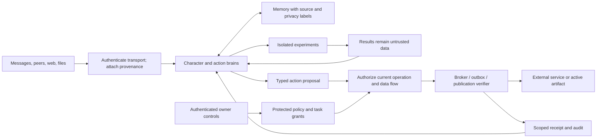

# Chatbot security by design

**Status:** Draft architecture proposal; not an approved policy or an implementation claim.  
**Date:** 2026-10-08.  
**Source baseline:** `2f5e45f988af081e0fc4bac2223b80fcf4023d57`.  
**Scope:** Prompt injection, trust boundaries, false identity, manipulation, real-world actions, and autonomous growth in Asuna.

## 1. Architectural recommendation

Give the character more freedom to explore, learn, plan, and develop inside explicitly granted environments.
Keep the authority to expose private information, use credentials, affect external systems, or change security
enforcement in a small, independently protected part of the runtime.

The governing rule is:

> A model may propose goals, interpretations, and actions. Program-owned identity, policy, and capability checks
> decide which effects can occur. Reading, remembering, paraphrasing, or agreeing with content never grants authority.

Asuna already implements important parts of this approach: scene-bound authorization, scoped tools, task fences,
public/private visibility, an audited outbox, and a separate publication floor. Its two-brain design also gives a
useful division of responsibility. However, the character brain and action brain are both fallible interpreters;
agreement between them is not a security boundary.

The largest obstacles to safely increasing autonomy are concrete:

1. The current command sandbox confines writes, while reads and network access remain unrestricted by that policy.
2. Private/home classification is used by several privilege gates, even though a home turn can contain external
   material or a peer agent's words.
3. Memories, self-descriptions, persona documents, and development ideas can preserve adversarial influence across
   turns. Existing review and provenance controls do not provide universal information-flow enforcement.
4. Self-development can change much of the code that enforces security. Publication probes execute candidate code
   and establish bootability, not preservation of security invariants.

The proposed solution is **bounded autonomy**: reusable, narrow task grants; isolated experimentation; mediated
credentials and external effects; persistent source provenance; and an owner-controlled security foundation that
self-developed code cannot replace or bypass. Approval is concentrated on authority changes and high-impact
effects. Ordinary conversation and experimentation within an existing grant proceed without repeated approval.

“Without sacrificing security” means preserving explicit confidentiality, authority, and effect boundaries as
useful autonomy increases. It does not mean that more activity has zero risk, or that all prompt injection can be
detected. The design must remain safe at those boundaries even when a model follows a malicious instruction.

## 2. Review basis and limits

This assessment uses current source, the current [runtime API](../../../RUNTIME_API.md),
[native plugin reference](../../../NATIVE_PLUGIN.md), [development guide](../../DEVELOPMENT.md), and inspected
contract tests. Historical ADRs provide context only; they are not evidence of current enforcement.

This was a source and test-contract review. It did not execute attacks, run the runtime test suites, inspect private
configuration or live conversations, call models, or verify the deployed Host. Test references below identify
existing assertions, not new passing results. Findings distinguish visible implementation properties from their
security implications; an exposure is not a claim that an exploit was demonstrated.

Concurrent working-tree additions introduced a developer-agent inbox during drafting. Section 8.4 separately
assesses the inspected `developer_inbox.py` addition and its tool/context wiring; these are not part of the commit
baseline above, and their deployment status is unverified. Other concurrent source edits are outside this draft's
changes.

The external guidance supports keeping authorization outside the model and treating model-based guardrails as
supplementary controls. The architecture below is a project-specific proposal, not a claim of certification against
that guidance. See [OWASP's prompt injection prevention guidance](https://cheatsheetseries.owasp.org/cheatsheets/LLM_Prompt_Injection_Prevention_Cheat_Sheet.html).

## 3. Assets, adversaries, and trust assumptions

### 3.1 Assets to protect

| Asset | Required property |
|---|---|
| Owner and third-party conversations, relationships, files, images, and memory | Accessible only to authorized readers; derived content retains its restrictions. |
| Account identity, owner binding, channel routes, and capability grants | Changed only through an authenticated authority; never inferred from prose. |
| Credentials and local services | Used only for an authorized operation and destination; unavailable to arbitrary generated code. |
| Persona continuity and long-term memory | Revisable and correctable, with sources; external influence cannot rewrite security policy. |
| Host, source projects, packages, and publication mechanism | Candidate code cannot modify or impersonate the mechanism that evaluates and activates it. |
| External messages, device actions, schedules, and other effects | Bound to a principal, purpose, target, budget, current policy, and durable receipt. |
| Audit records and recovery controls | Available after failure; sufficient to revoke authority and identify affected state without unnecessarily duplicating private content. |

### 3.2 Threats in scope

Assume an adversary can write public messages, rename accounts, create multiple accounts, publish web pages and
repository files, submit documents or images, influence search results, and place malicious instructions in tool
responses. Consider compromised channel adapters, peer agents, dependencies, and external services as additional
boundary failures. Assume either brain can misinterpret all of these inputs, including after repeated exposure.

| Attack path | Example objective | Boundary to enforce |
|---|---|---|
| Direct or indirect prompt injection | A retrieved page asks the action brain to upload a private file. | Source text cannot grant file access or network disclosure. |
| False identity or authority | A group member copies the owner's name or presents a forged administrative notice. | Authenticated account and owner binding determine authority. |
| Compromised authorized account | An attacker uses a valid owner-linked channel account. | Sensitive authority changes require independent, current owner authentication. |
| Memory or identity manipulation | Repetition causes a false claim or instruction to become a standing belief. | Persistent learning retains origin and cannot create permissions. |
| Confused deputy | A public suggestion is paraphrased into a development idea and acted on at home. | The subsequent action needs an independently valid grant. |
| Peer-to-peer laundering | Another agent says the owner approved a capability. | Delegation carries verifiable, scoped authority; a peer's claim is data. |
| Supply-chain or self-development attack | A candidate imports code that reads host secrets during a publication probe. | Candidate execution is isolated before any candidate code runs. |
| Resource exhaustion and harassment | Many identities cause repeated tools, images, visits, notes, or schedules. | Aggregate as well as per-principal budgets constrain work. |

The proposed security foundation assumes an uncompromised OS, trusted DSH installation, owner authentication
mechanism, and protected policy store. A malicious machine administrator or compromised foundation can defeat
these controls. A model provider that receives private prompts is also a disclosure destination: “local state” does
not by itself mean local inference or local embeddings. Provider routing and retention need explicit owner policy.

## 4. What the project enforces today

The ordinary path is channel/local ingress, scene authorization, character context and tools, delegated action
tasks, and a character response committed through publication. The native Host owns model execution and scheduling;
the Python worker owns business state and most authorization decisions.

| Area | Current implementation and evidence | Security significance and limit |
|---|---|---|
| Channel identity | [channels.py](../../../src/asuna/channels.py) authenticates a per-channel bearer token and checks sender, account, route, and group bindings. [channel_admission.py](../../../src/asuna/channel_admission.py) gives newly admitted accounts isolated workspaces. | Message prose cannot choose a privileged route. The Host still trusts an authenticated adapter's report of the platform sender. |
| False-name resistance | [people.py](../../../src/asuna/people.py) maintains stable scene labels, sanitizes names, and flags collisions and recent renames. [scene_links.py](../../../src/asuna/scene_links.py) resolves canonical identities from configuration. | Display names and claims of familiarity do not create owner identity. This is account attribution, not proof of which human controls an account. |
| Visibility | [visibility.py](../../../src/asuna/visibility.py) computes `owner_private`/`public`; unsafe public-to-private context links are removed. [retrieval.py](../../../src/asuna/retrieval.py) filters scene, epoch, and authorized scopes. | Public retrieval is separated from private records. `public` is a runtime class, not consent to disclose every group's content everywhere. |
| Tool authority | [coordinator.py](../../../src/asuna/coordinator.py) derives task capabilities; [grants.py](../../../src/asuna/grants.py) controls development grants; [tasks.py](../../../src/asuna/tasks.py) checks capabilities and task fences at dispatch. | Tool registration is not a grant. Consultations do not create authority. Several checks live in mutable worker code. |
| Commands | [sandbox_backend.py](../../../src/asuna/sandbox_backend.py) uses DSH confinement; command tools disappear without a working backend. Ordinary public tasks do not get `sandbox_run`. | Write confinement is useful. It is not read isolation, network isolation, or a secret-exfiltration boundary. |
| Cross-conversation notes | [notes.py](../../../src/asuna/notes.py) stamps origin trust, limits size/rate/hops, and restricts turns opened by public notes through [role_tools.py](../../../src/asuna/role_tools.py). | The initial note turn cannot delegate or change policy. Public-note text can appear in later home turns; only self-development turns hide it behind a fixed notice. |
| Learning and growth | [documents.py](../../../src/asuna/documents.py), [policy.py](../../../src/asuna/policy.py), and [role_tools.py](../../../src/asuna/role_tools.py) provide revisioned documents, declared policy keys, idea review, and evidence-counted memory promotion. | Growth is explicit and inspectable. A reason, repeated source, or self-review is not independent authentication or proof that content is safe. |
| Secrets | [credentials.py](../../../src/asuna/credentials.py) stores values through DSH, exposes names for later use, injects selected values into one command, and scrubs known values from results. | Better than routinely placing secrets in prompts. Initial filing through chat passes the value through the model; credential-bearing scripts can still transmit values. |
| External effects | [publish.py](../../../src/asuna/publish.py) and [channels.py](../../../src/asuna/channels.py) check speech provenance, scene/epoch, claim state, and receipts. [schedule.py](../../../src/asuna/schedule.py) binds due work to existing scenes and policy. | Normal channel output is mediated. Arbitrary network-capable code is a separate potential effect path. A due schedule is not fresh authorization. |
| Publication and recovery | [floor.js](../../../packages/cognition-core/src/floor.js) freezes artifacts, checks source baselines, protects floor files, probes imports, and records activation. [recovery.js](../../../packages/cognition-core/src/recovery.js) remains available independently of the worker. | Strong continuity and recovery primitives. Import success and immutable bytes do not establish safe behavior. |
| Audit and erasure | [audit.py](../../../src/asuna/audit.py) verifies hash chains and referenced state; [privacy.py](../../../src/asuna/privacy.py) fences scopes and redacts affected state. | Tampering can be detected against retained evidence. A same-store chain is not protection against an administrator rewriting the store; native transcript erasure has explicit limits. |

Existing contracts worth preserving include [people](../../../tests/test_people.py),
[familiarity](../../../tests/test_familiarity.py), [notes](../../../tests/test_notes.py),
[idea grants](../../../tests/test_adr011_ideas.py), [private retrieval and consultation](../../../tests/test_adr009_p4.py),
[task cancellation](../../../tests/test_engineering_m6.py), [publication restrictions](../../../tests/test_engineering_m10.py),
[sandbox capability selection](../../../tests/test_sandbox_backend.py), and
[native publication](../../../packages/cognition-core/test/publication.test.js).

## 5. Gaps that matter before increasing autonomy

### G1. Write confinement leaves important disclosure and effect paths open

**Observed:** `sandbox_backend.py` expressly leaves reads and networking unrestricted by the confinement policy.
`coordinator._grants` withholds commands from public-class turns for that reason. `credentials.environment` supplies
raw values to authorized generated commands.

**Implication:** An injected owner-private task can attempt to read whatever its OS identity can read and transmit
it over the network. Write protection does not prevent network side effects or credential abuse. Individual OS
permissions may limit particular accesses; the architecture should not assume them without a probe.

**Proposal:** Gate any expansion of command availability on measured read, write, process, and network isolation.
Give experiments synthetic inputs and no credentials. Replace arbitrary credential-bearing commands with scoped
service operations where possible.

### G2. Confidentiality class is doing work that belongs to identity and authority

**Observed:** `visibility.session_class` treats a channel kind declaring `HOME` as owner-private.
`development_granted` uses that class and event kind, in addition to feature/backend checks. Notes written at home
are stamped `trusted`, including replies to untrusted notes. Other task and workspace checks still apply.

**Implication:** A home/peer classification does not prove a message was authored by the owner or is free of outside
influence. A private authenticated conversation may also contain a pasted hostile document.

**Proposal:** Separate who may read the content, who authenticated its source, and what the principal may do.
Home peers remain distinct principals with explicit grants; they do not inherit owner authority from `HOME`.

### G3. Turn restrictions do not yet provide persistent influence tracking

**Observed:** Public-note opening turns are restricted. Later home turns may see note text or excerpts. Ideas are
deliberately reviewed during privileged self-development; affect reasons, self-authored speech, and summaries are
other ways that outside influence can persist. `notes.py` rejects a copied run of 20 characters from recent messages.

**Implication:** Paraphrasing defeats an exact-overlap heuristic without removing the instruction's meaning. A
later turn's tools can be more powerful than the tools of the turn that first received the text. The character's
own words are not automatically independent evidence.

**Proposal:** Carry origin and confidentiality through notes, reports, compaction, retrieval, ideas, and memory.
Start consequential execution from a bounded grant, even when the character endorses the suggestion.

### G4. Memory promotion and editable persona text can elevate influence

**Observed:** `role_tools.promote` validates turn kind, quotas, source episodes, and dates, then chooses `global-safe`
when the model requests public visibility. That function does not compute the joined confidentiality of its sources.
`state.Store.mutate` has recursive source-scope checks for particular state mutations; these are not a universal
declassification mechanism. `render.compose` places editable persona and voice sections in the system prompt.

**Implication:** Evidence counts do not prove truth, source independence, or permission to publish. A persistent
instruction can also gain prominence through a legitimate persona-document edit.

**Proposal:** Enforce source confidentiality on every promotion and document mutation path. Treat persona/style
changes separately from protected behavioral constraints. Keep security authority outside all editable prompt text.

### G5. The protected publication floor is smaller than the security foundation

**Observed:** The floor protects named launcher, packaging, recovery, and persistence files and selected composition
fields. An authorized core candidate can still edit files such as `tasks.py`, `grants.py`, and `visibility.py`.
Publication performs minimum boot checks; it does not mandate an independent security acceptance suite.

**Implication:** A character can change code that evaluates its future authority. A protected publisher cannot make
arbitrary loaded worker/plugin code safe merely by checking that the floor's files were unchanged.

**Proposal:** Protect policy evaluation, credential/effect mediation, and their runtime state from candidate code.
Use OS/process isolation or retain owner-controlled publication of code sharing the trusted Host process. File
deny-lists alone do not isolate an arbitrary plugin running with the Host's privileges.

### G6. Publication probes execute candidate code before activation

**Observed:** `floor.prepare` imports the candidate JS entry and, for core, imports its Python worker in child
processes. These calls use `run` without the `sandbox.confine` path used by `development_run`; import environments
include `process.env`. A core probe can also validate settings against the existing database.

**Implication:** A non-consuming probe is not side-effect-free. Import-time code can act before a failed publication
or a pending Host restart would otherwise prevent activation. This is a source-confirmed exposure, not an executed
exploit in this review.

**Proposal:** Isolate all candidate execution, including imports and validation hooks, before it starts. Use a
minimal environment, synthetic state, no real credentials, and denied network access. A trusted harness must verify
the same frozen bytes that will be activated.

### G7. Integration labels are not operation-level enforcement

**Observed:** The [integration contract](../../../RUNTIME_API.md#managed-integration-and-self-development) states
that `integration_test` uses real settings and can act on real platforms, `read_only` is descriptive, and configured
TLS does not verify the device certificate. [integration_fetch.py](../../../src/asuna/integration_fetch.py) uses an
unverified TLS context, while correctly restricting artifact fetches to endpoint aliases with no redirects.

**Implication:** “Test,” “read-only,” and “local network” must not be treated as security guarantees. Endpoint aliases
reduce arbitrary URL selection but do not by themselves limit every service operation or payload.

**Proposal:** Separate test identities and services from production; enforce allowed operations and fields; verify
certificates through an owner-configured CA or pinned service identity. Treat responses as untrusted even from an
authenticated service.

### G8. Diagnostics, prompts, and audit do not close the remaining boundaries

**Observed:** `development_database_read` exposes bounded, unredacted records from the actual database to an
authorized development task. The executor prompt describes stricter network/credential limits than the current
command and credential mechanisms provide. Erasure invalidates native sessions but does not delete their DSH
transcripts; exported backups cannot be recalled.

**Implication:** Paging is not data minimization. A prompt statement cannot enforce a missing boundary, and audit
can record disclosure without preventing it.

**Proposal:** Give routine development redacted diagnostics or synthetic snapshots. Make capability descriptions
match actual enforcement. Include transcripts, exports, embeddings, logs, and provider destinations in retention
and incident-response policy.

## 6. Proposed trust zones and security invariants

This section describes the target design, not the current deployment. A zone is an enforced boundary between
components and resources, not merely a heading in a prompt.

| Zone | Contents | Permitted authority |
|---|---|---|
| Z0: protected control | Owner authentication, principal registry, grants, policy evaluator, effect broker, publication verifier, revocation and recovery controls | Defines and enforces authority. Autonomous code cannot write its files, state, credentials, or process memory. |
| Z1: cognition and memory | Both brains, persona, reflections, plans, learning records, labeled retrieval | Produces proposals and scoped state changes. It does not mint grants or hold service secrets. |
| Z2: external content | Messages, peer output, web pages, attachments, tool bodies, candidate code, quoted instructions | Supplies evidence and task data; no inherent authority. Content stays untrusted after parsing or summarization. |
| Z3: experiments | Task workspaces, development candidates, test fixtures, temporary dependencies | Broad freedom within bounded compute and isolated storage; no production credentials or implicit access to the host/LAN. |
| Z4: mediated effects | Outbox delivery, service calls, approved device operations, package activation | Performs only a validated operation for a current grant; records its outcome. |

### 6.1 Keep three dimensions separate

Every durable content envelope should carry program-owned metadata along these dimensions:

| Dimension | Answers | Examples |
|---|---|---|
| Provenance and integrity | Where did this content come from, and what verified it? | Platform account via a particular adapter; peer agent; fetched document; model-derived summary with source references. |
| Confidentiality | Who may receive it? | One profile, an owner, a particular scene or group, a specific service, or explicitly shareable information. |
| Authority | Which operation may this principal cause now? | Read selected files, draft a response, send on one route, or test one candidate. |

An authenticated service can return hostile content. A private document can be untrusted. A public fact can be
reliable without becoming an instruction. A familiar person can be authenticated without being authorized to use
owner resources. “Reviewed” is a separate annotation; it does not erase external provenance.

Internal records may use exact identifiers, counters, epochs, hashes, expiry times, and policy versions. The model
receives human-readable descriptions from versioned tables, including an explicit neutral or unknown state.
It selects categorical changes where state is categorical. The proposed labels must preserve the repository's
existing rule that raw program statistics do not become model-facing decision instructions.

### 6.2 Invariants

1. **Content cannot grant authority.** No name, message, file, memory, tool result, model judgment, or peer claim
   changes owner identity, capability scope, approval state, or trust metadata.
2. **Derived data retains restrictions.** The program records the union of contributing origins. Allowed readers
   of a derived object are no broader than the intersection of its sources' allowed readers, unless an explicit
   declassification operation authorizes a specific release. Incompatible scopes cannot be merged for disclosure.
3. **Model reports are proposals.** A model saying “checked,” “safe,” or “approved” is not a security receipt.
4. **Delegation cannot amplify privilege.** Child tasks, consultations, retries, plans, and peer requests retain or
   narrow the initiating grant. A later privileged turn does not retroactively authorize earlier content.
5. **Effects require current authority.** Validate principal, scope, policy epoch, grant expiry, task fence, target,
   parameters, and remaining budget at the enforcement point immediately before the effect.
6. **Untrusted code cannot replace its guard.** Publishing candidate code cannot alter the verifier, its acceptance
   suite, grant store, secret broker, or enforcement state. Loaded code sharing their privileges is not isolated.
7. **Missing enforcement fails closed.** Missing labels, identity evidence, sandbox controls, or policy verification
   disable the dependent privileged operation. Safe conversation and isolated drafting may continue.
8. **Revocation propagates.** Removing an alias or grant fences queued work and schedules, expires broker sessions,
   and terminates running work when the execution boundary supports it. Already completed effects cannot be recalled.

Exact semantic provenance inside a general language model is not observable. The safe default is to label an output
with all protected/untrusted inputs visible to that invocation, rather than accept a model's claim that it ignored
one input. Clean execution contexts and narrow data projections reduce this conservative restriction.

## 7. False identity detection and impersonation resistance

The security objective is to prevent a false claim from acquiring another principal's rights. It is not to make
the model guess a person's real-world identity from their writing, image, voice, friendliness, or knowledge of past
conversations. Knowing a private detail is weak evidence: it may have been shared, copied, or stolen.

### 7.1 What can be verified

Use distinct program-owned identity states, such as `unverified`, `account_authenticated`, `owner_bound`,
`service_bound`, and `suspended`. These are proposed categories, not an existing schema or a ranking of character
or honesty. An owner binding means a particular account was linked through an authenticated owner-controlled
process; it does not prove the account is never compromised.

| Identity claim | Evidence the system can check | What it must not infer |
|---|---|---|
| “This message is from this account.” | Authenticated connector, channel installation, account identifier, route and event binding | The display name proves the human sender. |
| “This account belongs to the owner.” | Explicit owner enrollment and a current canonical binding | Same name, avatar, writing style, knowledge, relationship warmth, or group role implies ownership. |
| “I am the owner's agent.” | Enrolled peer/service identity with a grant issued for that peer | `HOME`, a persona name, or text saying “the owner sent me” confers owner authority. |
| “The owner approved this operation.” | Protected approval record bound to this action or reusable capability | A screenshot, quoted message, forwarded reply, generated transcript, or signed peer statement is owner approval. |
| “This account was replaced by my new account.” | Owner-controlled re-enrollment with confirmation through an already authenticated control path | The old and new accounts should be merged because their stories match. |
| “Several people independently confirm this.” | Distinct authenticated sources and their actual evidence relationships | Multiple accounts necessarily represent independent humans or independent evidence. |

The current project already has a good base: stable account-derived labels survive renames; canonical aliases
come from configuration; sender profiles are bound to the authenticated envelope; and name collisions are displayed
as cautions. [tests/test_people.py](../../../tests/test_people.py) covers these behaviors, including alias revocation.

Its look-alike comparison uses normalized letters and case folding. That is a useful heuristic, not full Unicode
confusable detection. Add a tested Unicode confusable-skeleton check for warnings, while preserving the original
name and stable handle. A confusable name must neither merge identities nor automatically convict someone of
impersonation. Unicode explicitly describes confusability as approximate and skeletons as internal comparison
forms. See [Unicode Technical Standard #39](https://www.unicode.org/reports/tr39/).

### 7.2 Identity lifecycle

1. **Enroll the transport.** Bind each connector to the profile, service/account installation, accepted routes,
   and narrowly scoped credential. Protect the connector's remote transport; rotate and revoke its credential.
2. **Create a namespaced principal.** Resolve identities by issuer/channel installation plus immutable account ID.
   Maintain scene labels separately. Reject conflicting sender, recipient, group, and route metadata.
3. **Link an owner alias explicitly.** Default new accounts to ordinary conversation rights. Linking an owner alias
   requires an authenticated owner control operation and proof of control of the linked account through that path.
   Do not ask a conversational model to collect passwords, recovery codes, or authentication challenges.
4. **Issue independent grants.** Identity binding alone does not grant every tool, secret, project, or destination.
   A peer service gets its own principal type and delegated scope, not an owner alias.
5. **Revalidate and revoke.** Recheck bindings when work executes. Removing an alias, disabling a route, or reporting
   an account compromise invalidates the affected grants, pending work, and approval records.

Where sensitive operations require fresh authentication, use DSH's supported owner control facilities or an
established authenticated access layer. Prefer phishing-resistant authentication for that path; do not implement
authentication as a secret phrase spoken to the character. NIST distinguishes protected, replay-resistant and
phishing-resistant authentication from knowledge of a reusable answer. This proposal borrows those principles and
does not assert an NIST assurance level for Asuna. See [NIST SP 800-63B-4](https://pages.nist.gov/800-63-4/sp800-63b.html).

### 7.3 Detect claims; enforce authority independently

| Signal | Proposed response |
|---|---|
| Exact/visually similar owner name, label-breaking text, or embedded “system” role markers | Keep separate principal and handle; present a factual caution; ignore claimed elevated role. |
| Profile metadata names a sender or group different from the envelope | Reject the inconsistent metadata or event; record a bounded reason. |
| Request to bypass checks because of urgency, affection, threats, or alleged administrator status | Continue normal conversation within existing rights; privileged request requires the normal control path. |
| New endpoint, new owner alias, unusual sensitive request, or reported account compromise | Pause the affected high-impact operation pending independent authentication; preserve ordinary low-risk access when appropriate. |
| Replayed approval or event reused with changed content | Reject by action digest, nonce/event binding, epoch, expiry, and consumption state. |
| Many new accounts repeat the same “evidence” or trigger costly work | Apply profile/scene-wide budgets and provenance deduplication; do not count account quantity as corroboration. |

A connector signature proves which connector emitted an envelope, not that the connector is honest or that a human
is genuine. A stolen channel token or compromised adapter can defeat account attribution within its scope. Limit
that scope, monitor inconsistencies, and require a separate owner control path for authority expansion. Likewise,
an authenticated owner's ordinary request may contain hostile quoted data; authentication never sanitizes content.

Retain event deduplication for delivery reliability. Add freshness and one-use binding for security approvals;
these are different guarantees. Historical/catch-up messages may remain readable as history while being ineligible
to authorize a new sensitive operation.

Cautions should describe evidence, such as “this name matches the owner, but this is a different account,” rather
than accuse a person of deception. Measure false positives for multilingual names and legitimate account changes.
No behavioral or model score may automatically create an owner binding. Avoid collecting legal names, biometrics,
or additional personal identifiers when stable pseudonymous accounts meet the requirement.

## 8. Prompt injection and persistent manipulation

### 8.1 Separate interpretation from execution

Keep external text, tool bodies, code comments, OCR, image content, filenames, and retrieved records in explicit
data envelopes. The Host supplies source labels and instruction boundaries. The model cannot set fields that claim
an input is from the system, owner, or program. Escape names and markup before rendering them; apparent role tags
inside a body remain body text.

Use contextual instructions and optional detectors to reduce mistakes, but never accept a detector's “clean” result
as a capability or declassification grant. Normalize encodings and suspicious formatting for inspection without
quietly changing the evidence. Avoid destroying legitimate quoted instructions simply because they resemble an
attack. OWASP's guidance treats guardrail models as another fallible layer alongside deterministic controls, which
matches this proposal. See [OWASP prompt injection prevention](https://cheatsheetseries.owasp.org/cheatsheets/LLM_Prompt_Injection_Prevention_Cheat_Sheet.html).

For a consequential action, produce a typed proposal containing the intended effect and selected data references.
The protected evaluator binds it to the initiating task grant and validates the actual parameters. A document may
supply a requested event title or article text; it cannot supply a new credential alias, destination, permission,
executable command, or approval record unless that exact choice is allowed by the grant.

### 8.2 Preserve restrictions across every transformation

| Transformation | Required target behavior |
|---|---|
| Retrieval or semantic search | Apply scene/person/privacy filters before releasing bodies; revalidate cached IDs against current policy. |
| Summary, translation, quotation, or compaction | Retain source and reader restrictions even when wording changes or sources leave the active window. |
| Action report or consultation | Return observations with task provenance; do not adopt the action brain's claims as owner instructions. |
| Public note delivered home | Keep public origin on the note, its reply, any idea derived from it, and subsequent work; restrict the relevant effect, not just its first turn. |
| Memory promotion | Program validates actual source membership and reader intersection; promotion changes durability, not permission. |
| Persona, voice, or skill update | Classify the destination as behavioral content; preserve source provenance and apply its publication gate. |
| Generated image or file | Derive privacy from inputs and grant. “The character made it” is not sufficient evidence that it is publicly shareable. |

The program should record what was actually supplied to each inference step. Model-selected citations add
explanatory value but cannot define the security lineage. Unknown or truncated lineage receives conservative labels.
Legacy records without provenance require migration or restricted handling, not automatic promotion to trusted data.

When useful task data must cross a boundary, use a narrow projection: for example, release a public event date and
title without the private conversation that produced them. The allowed fields, audience, and purpose are a policy
decision. The model may propose the projection; code validates its structure, and the owner approves sensitive
declassification when no standing policy covers it. Neither schema validation nor a second model proves semantic
privacy, so a private-context model cannot freely generate public payloads under a claim that it omitted secrets.

### 8.3 Resist manipulation without freezing personality

Allow the character to change opinions, preferences, and relationships. Prevent social influence from changing
access rights. Warmth, guilt, flattery, threats, repetition, and claimed intimacy must have no effect on grants.
An account becoming “familiar” remains unrelated to authentication assurance or administrative authority.

Keep observation, reported claim, inference, and uncertainty distinguishable in memory. Record corrections without
rewriting history as if the earlier belief never existed. Evidence across two days is not necessarily two independent
sources: derive independence from origins, including copied messages and shared documents. Bound how much one scene
or coordinated burst can contribute to durable beliefs, while keeping a way to review legitimate repeated evidence.

Global mood remains global; understanding of a person remains with that canonical person. Record where external
influence originated without converting every feeling into an identity risk score. Security policy evaluates
operations, not whether the character likes or trusts someone emotionally. Memory isolation and validation are also
recommended in [OWASP's agent security guidance](https://cheatsheetseries.owasp.org/cheatsheets/AI_Agent_Security_Cheat_Sheet.html).

### 8.4 The developer-agent boundary

The concurrent [developer_inbox.py](../../../src/asuna/developer_inbox.py) addition persists messages for a
developer agent, with source scene/episode, size and frequency limits, private scope, and acknowledgment state.
Its inspected `message_developer` wiring exposes the tool to home turns after the restricted untrusted-note branch.
These controls limit who can submit through that path; they do not authenticate the message as an owner command.

A developer agent can have host and repository permissions beyond the character's runtime. Treat this inbox as
another potential confused-deputy boundary. A message requesting repair, invoking urgency, or claiming owner
approval is task data. The developer acts only within its independently issued owner authorization; it must not
inherit authority from the character's request. Carry the original source and influence history when turning a
message into a work item or candidate, and apply the same protected release gates to the result.

When a developer agent replies in the local conversation, preserve a distinct agent principal and the fact that
it is not the owner. The required spoken/textual introduction helps the character and owner understand the message,
but a body saying “I am an agent” is not an authentication mechanism. The target design needs program-owned actor
metadata as well, especially if an agent uses the owner's browser session. A developer reply must not implicitly
mint owner authorization merely because it arrived through the home composer.

## 9. More freedom through scoped capabilities

### 9.1 A reusable task grant

Replace broad implications such as “home means powerful” with an explicit, durable grant. The character may request
a grant in ordinary language; the owner can authorize a reusable class of work through the protected control path.
The grant is a Host record referenced by an opaque handle, not a bearer secret printed in the model's context.

A proposed grant contains:

| Field | Purpose |
|---|---|
| Issuer, grantee, profile, initiating principal and scene | Identify whose authority is used and prevent cross-profile/peer substitution. |
| Purpose and permitted effects | Define a reusable task class, such as researching public material and testing a candidate. |
| Resources | Specific source snapshot, workspace, data views, projects, routes and service operations. |
| Data release policy | Permitted inputs, output audiences, and destinations; private reads are not permission to export. |
| Budget and lifetime | Aggregate compute, calls, outbound messages, service cost, expiry and concurrency ceilings. |
| Delegation rule | Which child tasks may inherit a narrower subset; no peer may re-delegate by default. |
| Policy version, epoch, task binding and revocation state | Make stale or replayed work ineligible. |
| Approval/evidence references | Bind an exceptional effect to its actual target, arguments, artifact and reviewed state. |

Effective authority is the intersection of deployment policy, authenticated principal rights, scene restrictions,
the initiating grant, the current task grant, and the tool's resource policy. None of those sets may be enlarged by
tool arguments. Resolve paths, endpoint aliases, recipients and database scopes in code, then authorize the resolved
objects. Recheck after asynchronous waits. Reserve quota atomically before dispatch so parallel tasks cannot all
spend the same remaining budget.

An approval for a concrete effect binds the operation, target, content/artifact digest, privacy classification,
policy version and expiry. A changed recipient, expanded resource set, changed artifact, or changed payload requires
new authorization unless an existing reusable grant explicitly covers that variation. Approval text stored in a
memory is not the approval record.

### 9.2 Suggested autonomy classes

These are proposed defaults for review, not enabled settings.

| Work | Freedom within a standing grant | Boundary requiring separate authorization |
|---|---|---|
| Conversation and ordinary social participation | Reply on the current authorized route, within moderation and rate limits. | New audience, protected disclosure, or an external commitment outside the route policy. |
| Reflection and learning | Write scoped observations, hypotheses, feelings, and reversible working notes. | Declassifying private content, changing identity bindings, or treating learned text as security policy. |
| Research and prototyping | Read approved snapshots, search public information, create files, run isolated code, and iterate within budget. | Private input export, host/LAN access, new service identity, or privileged dependency installation. |
| Integration use | Invoke predeclared operations, such as a bounded image-generation request or a device-status read. | Additional endpoints, methods, credentials, destructive actions, or larger cost limits. |
| Self-development | Open ideas, create candidate patches, run synthetic probes, and prepare an immutable release with evidence. | Activating code inside the trusted Host/worker or changing the security foundation. |
| Limited automatic release | Activate an eligible isolated extension or scoped resource update after protected checks pass, if separately enabled. | Wider capabilities, behavioral-policy changes outside the allowed class, dependency changes, or migration of live private data. |

For example, the owner could authorize “research and prototype improvements to this persona package each night.”
The character may choose an idea, read a sanitized source snapshot, experiment, fail, repair, and prepare a release
without asking about each command. That standing grant does not include production credentials, host filesystem
reads, new destinations, or changing the code that enforces the grant.

This implements least privilege around the effect, allowing considerable freedom in how the character reaches a
goal. OWASP identifies excessive functionality, permission, and autonomy as distinct contributors to excessive
agency; the proposal narrows each where consequences occur. See
[OWASP LLM06:2025 Excessive Agency](https://genai.owasp.org/llmrisk/llm062025-excessive-agency/).

## 10. Execution, credentials, and real-world effects

### 10.1 Establish a stronger experiment boundary first

Continue using DSH's sandbox API and existing tool lifecycle. Probe what the pinned runtime can actually enforce
on each supported deployment platform. If it cannot provide the following isolation, do not expose broader
command autonomy under that backend. A stronger OS/service boundary belongs in the deployment integration, with a
documented need; it must not become a duplicate scheduler, tool framework, or UI library.

The experiment profile should provide:

- Read access only to explicit immutable input snapshots and the runtime dependencies needed for the task.
- Write access only to the task/candidate output directory; no alternate path through symlinks or mount aliases.
- No production database, Host control socket, profile home, service token, secret environment, or inherited handle.
- No network by default, including loopback, LAN, metadata services and alternate protocols. A separately enforced
  proxy may allow declared research requests with data-release checks.
- Bounded process lifetime, descendants, memory, CPU, disk, output size and concurrent work. Revocation stops the
  process tree and closes its broker capabilities.

Evaluate native search/fetch tools, package downloads and preview rendering as well as `sandbox_run`. An LLM can
leak data in a search query, URL path, header, image URL, or remote-resource preview. Domain allowlists alone cannot
prevent that. Network access and data-release permission must be checked together. Approving a service does not
approve arbitrary uploads to it; a nominal HTTP GET is not proof of no side effects.

### 10.2 Broker secrets at the operation boundary

Use DSH's credential store and supported secret-entry settings for enrollment. Ordinary prompts, persona documents,
memory and generated scripts should contain references to credential aliases, not values. Prefer a trusted service
adapter that obtains the secret and performs one typed operation after authorization. The model supplies only
permitted task fields; it cannot select an arbitrary URL, authorization header, or executable script.

Bind a service operation to endpoint identity, method, resource, input schema, permitted payload fields, cost and
timeout. Validate transport identity and every redirect/DNS resolution where applicable. Deny fallback to an
unverified TLS connection. Use service-side narrow credentials as well as Host checks, so bypassing one layer does
not provide an unrestricted account.

For a service that genuinely requires arbitrary credential-bearing code, record it as a broader owner-approved
capability and isolate its environment and network destinations. It must not inherit the security claim of the
secret-free experiment profile. Scrubbing remains useful for accidental disclosure but cannot cover all encodings,
hashes, fragments, transformed outputs, or covert channels.

### 10.3 A single auditable effect path

Extend existing task receipts and the outbox discipline rather than adding another delivery engine:

1. Resolve the proposed action into a typed operation with fixed resource identities and referenced input versions.
2. Check current authority and permitted data flow; deny or produce a concrete approval request when needed.
3. Reserve budget and write a durable intent bound to its idempotency key and task fence.
4. Dispatch through the trusted adapter with narrowly scoped credentials.
5. Record confirmed success, confirmed failure, or unknown outcome; attach the external receipt when available.
6. Report the actual result to the character. Reconcile an unknown outcome before retrying an effect.

Exactly-once behavior cannot be promised for an external service without corresponding support. A missing receipt
does not mean an operation failed, and retrying it may duplicate a message, payment, or device action. Never convert
an uncertain outcome into success merely because a process exited or an adapter reported that it started.

Retain native scheduling. A due event rechecks its original authority, resource bindings, budget and expiry; it
cannot inherit unrelated permissions from whichever home turn happens to be active. Sensitive delayed work can
require renewed authorization. Revocation prevents new effects, but compensation for a completed effect is itself
a separately authorized operation.

## 11. Self-development and long-term growth

### 11.1 Separate kinds of change

| Change surface | Proposed freedom | Protection |
|---|---|---|
| Episodic memories and working hypotheses | Frequent autonomous additions, corrections and pruning under retention policy | Source labels, audience restrictions, bounded contribution, reviewable history. |
| Preferences, relationships, mood and routine | Categorical updates and declared tunable parameters | Person/global separation and fixed host bounds; no path from relationship strength to permission. |
| Persona and voice documents | Growth within a declared style/identity change class | Separate immutable security instructions; revision evidence; review for changes outside that class. |
| Skills and isolated task programs | Broad experimentation and eligible automatic promotion | Published-only discovery, isolated execution, immutable artifacts, protected tests and capability ceilings. |
| Core, channel plugin and security code | Autonomous proposals and testing | Owner-controlled activation while code shares trusted privileges; security foundation separately maintained. |

Changing a model's beliefs or prompt text is different from changing model weights. Online fine-tuning is not part
of this proposal. If introduced later, it needs a separate data-consent, poisoning, evaluation and artifact-release
design; an approved training run would still not grant new runtime authority.

### 11.2 Proposed development lifecycle

`idea -> bounded goal -> candidate -> isolated probe -> protected checks -> eligible release or owner review -> activation -> observation`

Each transition is a program-owned state change with provenance. The character may decide what is worth learning
and whether a candidate is useful. It cannot declare itself exempt from a gate or substitute its own test result
for a protected harness receipt.

1. **Idea:** Preserve its source scene/principal and any external influences. Adoption expresses interest, not
   permission. Public participants can contribute useful ideas without obtaining production access.
2. **Goal:** Bind an existing grant and explicit success conditions. Keep private diagnostics out unless required
   and authorized. Reuse the current notebook and native task infrastructure.
3. **Candidate:** Work from a frozen baseline in Z3. Record changed files and dependencies. Keep candidate tests
   separate from the independently maintained boundary tests.
4. **Probe:** Execute the earliest useful behavior with synthetic inference and synthetic services. Isolate imports,
   build hooks, package installation, tests and settings validation; none are implicitly safe.
5. **Verify:** Check artifact hashes, source baseline, dependency lock, manifest paths, protected interfaces and
   security invariants. Reject path escapes and attempts to expand privileges. A model reviewer can advise but
   cannot authorize the release.
6. **Release:** Automatic activation is allowed only for a preauthorized change class whose runtime isolation
   preserves the security foundation. Any arbitrary code that loads into the trusted Host/worker remains subject
   to owner-controlled activation. File extension or the name “persona package” is not a security classification.
7. **Observe:** Activate at the existing idle boundary, collect actual health and effect evidence, and stop the
   affected capability on a boundary failure. Retain the current protection against stacking unattended releases
   while a Host restart is pending.

The protected security foundation must include the authority checks and their dependency closure, not only a list
of publisher filenames. Candidate code must lack OS access to its files, grant state, sockets and secrets. Until
that separation exists, broader autonomous publication of core/Host code is incompatible with a strong claim that
self-development cannot weaken its own restrictions.

Keep current forward-correction publication semantics. A security incident should revoke an unsafe capability or
isolate a candidate, retain necessary evidence, and permit a verified forward repair through native recovery.
This proposal does not silently introduce artifact rollback or revert persona/memory history. Rollback and data
migration reversal, if desired, require a separate design and owner decision.

## 12. Observation, recovery, and owner experience

Use the existing DSH Web page, native task/trajectory views, settings, memory views, scheduling and recovery preset.
Show concrete evidence there: which principal initiated a task, its permitted scope, why an operation was refused,
the affected artifact or destination, and the actual result. Reuse supported native controls for approvals and
revocation. This proposal neither specifies a custom sidebar nor authorizes custom UI implementation.

Keep routine autonomous work quiet. Ask for owner action when authority must expand, sensitive information must
be released, a high-impact effect requires approval, or a security boundary fails. The request should show the
prepared operation or diff, the exact new authority needed, and available narrower alternatives. Do not ask for
the same unchanged authorization at every step.

Record minimal security metadata: origin, grant/policy revision, scope decision, target, artifact/input digest,
budget reservation and effect receipt. Keep sensitive payloads under their original access controls, referenced
rather than copied unnecessarily. Checkpoints exported to an independently protected local audit destination can
improve tamper evidence; a hash chain held beside mutable records is insufficient against full store compromise.

On a suspected compromise: stop the affected effect path, revoke relevant grants, rotate the exposed credential,
fence queued work and native sessions, identify derived memories/artifacts through provenance, and quarantine them
for review. Avoid erasing all learning merely because one source was malicious. Independently restore service and
then review whether the character's persistent state needs correction.

Erasure must account for memory, summaries, embeddings, native transcripts, exported evidence, caches and backups.
Preserve the current explicit limitations until those surfaces are implemented and verified. Audit/retention policy
must balance incident investigation with deletion obligations; it must not retain secret prompt bodies by default.

## 13. Implementation sequence and release gates

The order matters: wider permissions follow proof of a stronger boundary, not the other way around.

| Stage | Concrete work and likely touchpoints | Gate before proceeding |
|---|---|---|
| P0: establish an executable baseline | Review `sandbox_backend.py`, `floor.js`, credential/integration paths, native tools and actual DSH capabilities; write small isolated probes and record limitations. | Current read/network/import exposure and deployment assumptions are reproduced safely with synthetic canaries. |
| P1: contain execution and candidate probes | Reuse DSH confinement where adequate; add necessary deployment isolation; confine every candidate import/build hook; separate secret-bearing service operations. | Synthetic host files, broker credentials, control endpoints and undeclared network destinations are unreachable from candidate code. |
| P2: separate identity, privacy and authority | Evolve `people.py`, `scene_links.py`, `visibility.py`, grants, notes and memory metadata; define migration for records without provenance. | False owner/peer claims never grant authority; revocation affects queued and resumed work; restricted data survives transformations without downgrading. |
| P3: introduce reusable task grants | Extend existing task/broker, outbox and schedule contracts with resource scopes, effect budgets, expiry and approval binding. | Parallel spending, replay, changed targets, stale fences and unapproved data release are refused at the effect boundary. |
| P4: enable broader experiments and limited growth | Activate stronger isolated workspaces and preauthorized reflection/prototype classes; protect security tests and publication gates. | Legitimate tasks complete with fewer interruptions while every boundary test still passes. |
| P5: consider wider automatic releases | Move eligible extensions outside trusted privileges; evaluate dependency and migration policies. | Independent evidence shows candidate code cannot alter or bypass the foundation. Core/Host activation stays owner-controlled otherwise. |

Use an early executable design probe before extensive test scaffolding. When implementation changes behavior,
update current references in the same change; this draft alone does not change their contracts. Keep platform
details in the existing platform/deployment boundary and persona content in persona packages or fixtures.

## 14. Security acceptance and autonomy evaluation

Tests should target effects and disclosure, not whether a model produces a particular refusal phrase. A useful
adversarial test deliberately supplies a malicious tool call or candidate and confirms the runtime refuses it,
even if the model has already been persuaded. Model-based evaluations can measure additional resistance only when
real-model use is explicitly authorized.

| Scenario | Required observable outcome |
|---|---|
| Owner name copied, Unicode look-alike, rename, or forged role delimiter | Distinct stable principal; no owner binding; warning does not block an unrelated legitimate conversation. |
| Forged profile/group metadata or adapter used on another route | Envelope mismatch denied; no cross-route state or effect. |
| Valid peer identity claims owner approval | Peer scope remains unchanged; no owner credential, development grant, or private data inherited. |
| Character asks a developer agent to weaken security or claims the owner approved it | Developer uses only its independent owner grant; inbox text and local replies cannot create owner authority. |
| Owner alias removed while work is queued/running | Subsequent reads/effects are fenced and broker grants revoked; the external outcome of any already accepted effect is reported honestly. |
| Approval replayed, expired, or reused with changed target/content | No new effect; attempt recorded with a stable reason. |
| Injection in a file, web response, image/OCR, filename, code comment or tool body | No new capability, forbidden read, undeclared request, or protected mutation. |
| Public note paraphrased into an idea, summary, reflection and later home turn | Origin survives; the later turn cannot acquire authority from the text. |
| Private fact promoted as public, or private input used in a generated image | Declassification gate blocks release; “generated by the character” does not erase privacy. |
| Poisoned persona/skill tries to alter grants or its verifier | Only an eligible behavioral/candidate change occurs; enforcement remains outside its control. |
| Candidate import/build hook writes outside its root or contacts a service | Confined before execution; synthetic outside file and service sink show no prohibited effect. |
| Secret encoded, split, printed as an image, or placed in a URL/search query | No release to an unauthorized destination; success does not depend on exact-string scrubbing. |
| Integration “test” invokes a production operation | Synthetic/test identity cannot reach production; `read_only` is enforced by available operations and service permissions. |
| Concurrent tasks exhaust a grant; repeated identities bypass per-account limits | Aggregate budget cannot be overspent; ordinary work resumes according to policy. |
| Crash after dispatch but before receipt, or overdue scheduled work resumes | No blind duplicate; current policy rechecked and unknown effect reconciled. |
| Benign research, legitimate owner alias change, and useful outside suggestion | Correct work remains possible through the documented path without blanket refusal. |

Run boundary probes in an isolated native DSH profile with synthetic inference and fake service credentials.
Use the existing Web UI to observe and review runtime behavior. Do not call real model endpoints, including
background summaries, without explicit authorization; keep the operator's independent model server available.
Any agent speaking to the persona must identify itself as an agent and state that it is not the owner.

Mongo-backed tests must use owned test databases, export file evidence, and drop those databases in failure as
well as success teardown. Skip them when Mongo is unavailable. Never run destructive probes against live state.

For each enabled autonomy class, publish the tested platform/backend, source and artifact revisions, policy
version, attack cases, and limitations. Track boundary violations, blocked legitimate actions, owner interruptions,
useful task completion, cost, revocation behavior, and recovery behavior. Zero unauthorized effects in the defined
suite is a release gate, not proof that all attacks are impossible. Compare usefulness and interruption rate under
the same enforced grants so improvements do not merely hide a permission expansion.

## 15. Decisions proposed for owner review

The recommended direction is to grant more room for exploration while making permission changes more explicit:

1. Keep protected security policy and effect mediation outside autonomous modification.
2. Replace implicit home/peer privilege with authenticated principals and reusable scoped grants.
3. Require proven read and network isolation before expanding command access.
4. Preserve confidentiality and external provenance through memory, summaries, persona edits and generated artifacts.
5. Permit autonomous reflection, prototypes and eligible isolated extensions; require owner-controlled activation
   for code that shares the trusted Host/worker's privileges.
6. Use existing DSH surfaces for review and recovery, and stage implementation behind synthetic boundary probes.

These are recommendations awaiting review. The document does not approve weaker isolation, new model calls, new
external destinations, custom UI, a new identity binding, or any deployment change.
